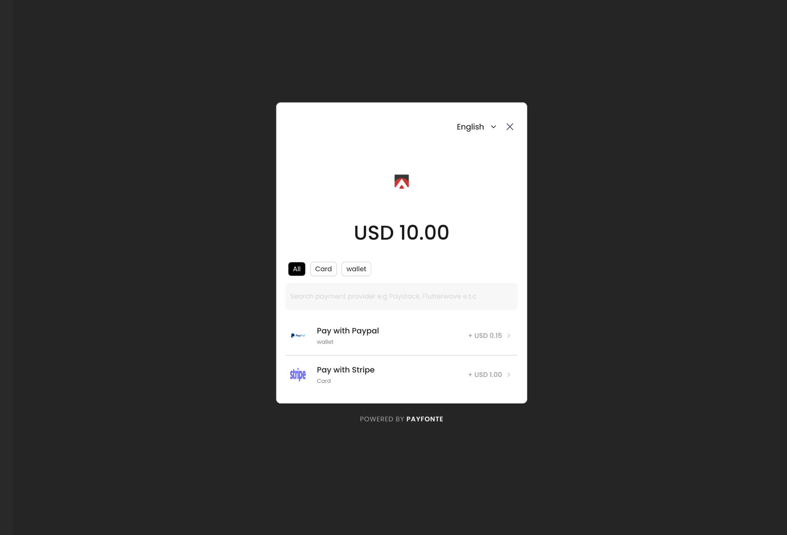
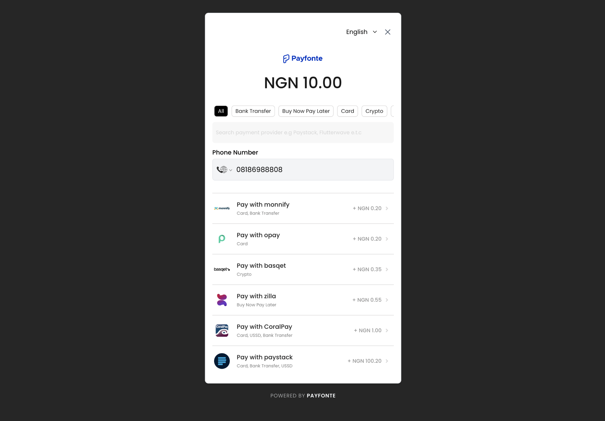

# payfonte-react

<div>
    
    
</div>

A React library that provides a reusable react hook for integrating with the Payfusion checkout system. <br/>
This hook allows you to easily accept payment by invoking its **handlePayfontePayment** method returned from the **usePayfonte** hook provides the accurate args are passed to the method.


## Installation

You can install `@payfonte/payfonte-react` using npm:

```bash
npm install @payfonte/payfonte-react
```

## Usage

1. Import the `usePayfonte` hook:
```jsx
import React from 'react';
import { usePayfonte, PayfontePaymentProps } from 'payfonte-react'
```

2. Create your `onSuccess`, and `onClose` callback functions to be passed when hooks is initialised:

```jsx
function onSuccess(data: any) {
  console.log(data);
}

function onClose() {
  console.log("payfonte modal closed");
}
```

3. Initialize usePayfonte hook - handlePayfontePayment
```jsx
  const { handlePayfontePayment, isPaymentLoading } = usePayfonte({
    isProduction: false, // can be true of false
    onClose,
    onSuccess
    clientId: 'payfusion', // required, Your client-id 
  })
```

4. configure payment config props to be passed to handlePayfontePayment
```jsx
    const config: PayfontePaymentProps = {
    amount: 1000, // amount * 100 - amount in lowest currency denomination e.g  kobo for naira, cents for dollars - 1000/100 = 10
    currency: 'NGN', //NGN, XOF, XAF, USD e.t.c depends on the currency the client provided
    reference: `${Date.now()}`, //if you have your own transactionId you want to track this payment with
    user: {
      email: 'email@example.com',
      name: 'John Doe',
      phoneNumber: '+XXX XXXX XXXXX'
    },// required - user object
    metadata: {} // optional - your data that will come back with the event
  }
```

4. Makepayment - pass config above to handlePayfontePayment method
```jsx
    return (
    <>
      <p>
        {isPaymentLoading ? 'Payment initiated' : 'Payment not initiated'}
      </p>
      <button onClick={() => handlePayfontePayment(config)}>Pay 10 NGN</button>
    </>
  )
```

